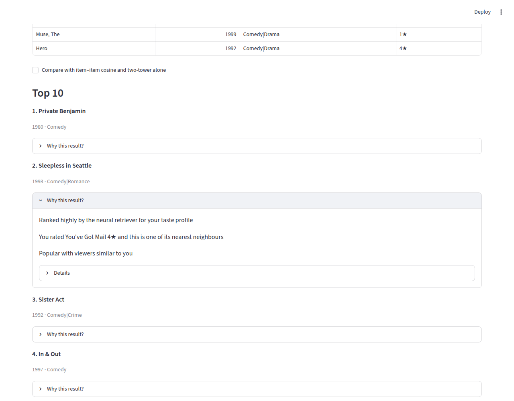
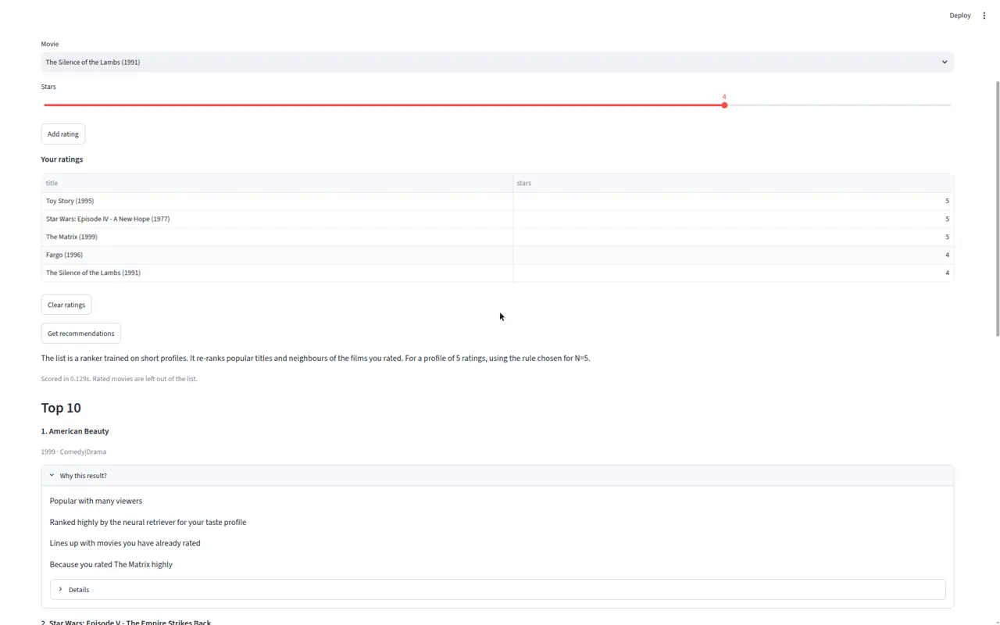

# movielens-recommender

A movie recommender built from scratch on [MovieLens](https://grouplens.org/datasets/movielens/) ratings, with an evaluation protocol strict enough that negative results are reported as such.

It covers the path from data to a demo: download and cleaning, a per-user time split, an evaluation harness with bootstrap confidence intervals, classic baselines, a two-tower retrieval model, a LightGBM LambdaRank re-ranker, and a Streamlit app that explains each recommendation in plain language and also serves people with no MovieLens history. The same harness runs on ml-latest-small, ml-1m, and MovieLens 32M.



## Contents

- [Findings so far](#findings-so-far)
- [Quickstart](#quickstart)
- [Project layout](#project-layout)
- [Roadmap](#roadmap)
- [Data](#data)
- [Evaluation protocol](#evaluation-protocol)
- [Models](#models)
- [Reproducing the results](#reproducing-the-results)
- [Tests and CI](#tests-and-ci)
- [How this was built](#how-this-was-built)
- [License and data terms](#license-and-data-terms)
- [Results](#results) (generated)

## Findings so far

Every number behind these sentences is in [Results](#results), generated from `results/*.json`.

- **ml-1m.** Tuned item–item kNN is a strong baseline. The two-tower model does not beat it on NDCG@10 (a recorded negative result), but it leads on Recall@100/200, catalog coverage, and the long tail. LambdaRank over two-tower candidates clears the item–item gate.
- **ml-32M.** The two-tower model and LambdaRank tie at the top and both beat item–item (ADR-0011).
- **Baselines.** EASE^R and RP3beta are tuned on the same validation split and compared in the results tables (ADR-0008).
- **Demographics (ml-1m).** User age, gender, and occupation features passed their pre-registered rule, so `configs/ml-1m.yaml` turns them on for the ranker (ADR-0009). The headline LambdaRank row in `results/ml-1m.json` is still the S4 feature set.
- **New users.** Someone with no MovieLens id rates a few films and gets an explained top 10. The cold-start panel reports quality after 1, 3, 5, and 10 ratings, next to known users and popularity (ADR-0012).
- **Other two-tower losses (S3e).** On ml-1m, full softmax and sampled softmax both beat the in-batch two-tower on test NDCG@10. LambdaRank on the validation-chosen new tower is worse than LambdaRank on the current two-tower, and worse than the new tower's own list (both paired intervals exclude 0). On ml-32M, sampled softmax does not beat the in-batch two-tower on validation, even at the same epoch budget, and full softmax was skipped for compute. The app keeps the current model (ADR-0013).

## Quickstart

Requires Python 3.10+. The core install covers data, baselines, and evaluation. The extras add the two-tower model (`deep`, CPU PyTorch), the ranker (`rank`, LightGBM 4.6.0), and the demo (`ui`, Streamlit 1.65.0).

```bash
python -m venv .venv
source .venv/bin/activate          # Windows: .venv\Scripts\activate
pip install -r requirements.txt
pip install torch==2.6.0 --index-url https://download.pytorch.org/whl/cpu
pip install -e ".[dev,deep,rank,ui]"
```

### Run the demo

```bash
movielens-recommender build-artifacts --config configs/ml-1m.yaml
movielens-recommender cold-start --config configs/ml-1m.yaml
streamlit run app/streamlit_app.py
```

`build-artifacts` downloads ml-1m if `data/` does not have it, reads the tuned hyperparameters from `results/tuning/`, and writes a serving snapshot to `artifacts/ml-1m/`. `cold-start` writes the new-user snapshot to `artifacts/ml-1m/cold_start/` and the measured table to `results/cold-start/ml-1m.json`. Nothing under `artifacts/` is committed.

The page has two modes:

- **Existing user.** Pick an ml-1m user. The list is the production pipeline: validation-chosen candidates re-ranked by LambdaRank with the ADR-0009 demographic features. Each title opens a plain-language explanation, and a checkbox shows the item–item and two-tower lists side by side (ADR-0010).
- **New user.** Search titles and rate at least three (about five is a good start). The page says which method produced the list for that profile size. It does not ask for gender, age, occupation, or ZIP, and it does not save the profile (ADR-0012).



## Project layout

| Path | What is there |
| --- | --- |
| `src/movielens_recommender/` | The package: data, split, metrics, evaluation, tuning, and the `movielens-recommender` CLI |
| `src/movielens_recommender/baselines/` | Most popular, item–item cosine, ALS, EASE^R, RP3beta |
| `src/movielens_recommender/two_tower/` | Two-tower model, features, training losses, and the S3e budget planner |
| `src/movielens_recommender/ranker/` | Candidate sets, ranker features, LambdaRank training, SHAP explanations, demographics |
| `src/movielens_recommender/serving/` | Serving snapshots (build, save, load), new-user serving, plain-language reasons |
| `app/streamlit_app.py` | The demo page |
| `configs/` | Run configs: `default.yaml` (ml-latest-small), `ml-1m.yaml`, `ml-32m.yaml` |
| `scripts/` | Results-table generator, EDA, and one-off experiment runners |
| `results/` | Committed experiment logs: metrics, intervals, tuning trials, budgets |
| `docs/problem.md` | Task definition, metrics, and the stage-gate rule |
| `docs/adr/` | One decision record per design choice and stage |
| `docs/eda/` | Aggregate EDA stats and figures (no raw data) |
| `tests/` | Unit tests on synthetic data |

## Roadmap

Each modeling stage must beat the previous best on **NDCG@10** on the same harness, or be written up as a negative result.

| Stage | Status | Focus | ADR |
| --- | --- | --- | --- |
| S1 | Done | Framing and data: download, cleaning, split, EDA, evaluation harness | [0001](docs/adr/0001-dataset-version.md)–[0004](docs/adr/0004-tooling-and-tracking.md) |
| S2 | Done | Classic collaborative-filtering baselines | |
| S3a | Done | Validation split, tuned baselines, segments, global-time-cutoff check | [0005](docs/adr/0005-validation-and-tuning.md) |
| S3b | Done | Two-tower retrieval | [0006](docs/adr/0006-two-tower-retrieval.md) |
| S3c | Done | EASE^R and RP3beta baselines | [0008](docs/adr/0008-ease-rp3beta.md) |
| S3d | Done | Scale-up to MovieLens 32M | [0011](docs/adr/0011-ml-32m-scale.md) |
| S3e | Done | Full-softmax and sampled-softmax two-tower | [0013](docs/adr/0013-full-softmax-two-tower.md) |
| S4 | Done | LightGBM LambdaRank over a validation-chosen candidate set | [0007](docs/adr/0007-ranker.md) |
| S4b | Done | User demographic features (ml-1m) | [0009](docs/adr/0009-user-demographics.md) |
| S5a | Done | Streamlit explainable UI | [0010](docs/adr/0010-streamlit-ui.md) |
| S5c | Done | New-user profile (cold start) | [0012](docs/adr/0012-new-user-cold-start.md) |
| S5b | Planned | Batch recommendations, FastAPI service, Dockerfile | |
| S6 | Planned | Operations: monitoring, refresh, drift | |

## Data

Archives come from the official GroupLens URLs and are checked against pinned SHA-256 checksums (ADR-0001). Raw and derived rating files live under the gitignored `data/` directory and are never committed. CI never downloads MovieLens.

```bash
movielens-recommender download --dataset ml-latest-small   # default
movielens-recommender download --dataset ml-1m
movielens-recommender download --dataset ml-32m
```

| Dataset | SHA-256 |
| --- | --- |
| ml-latest-small | `696d65a3dfceac7c45750ad32df2c259311949efec81f0f144fdfb91ebc9e436` |
| ml-1m | `a6898adb50b9ca05aa231689da44c217cb524e7ebd39d264c56e2832f2c54e20` |
| ml-32m | `e4a68655d7386b8f95f2f2424b2ff975dfdd15ffd59e0d864a14dca43e99d6ee` |

Only ml-1m has user demographics (`users.dat`), so `configs/default.yaml` and `configs/ml-32m.yaml` keep demographic features off.

**Cleaning rules**

1. Drop nulls in `user_id`, `item_id`, `rating`, `timestamp`.
2. Keep ratings in `[0.5, 5.0]`.
3. Require positive ids and timestamps.
4. Deduplicate `(user_id, item_id)`, keeping the latest timestamp (then the higher rating).

## Evaluation protocol

The full definition is in [`docs/problem.md`](docs/problem.md).

**Split.** For each user, deterministically:

1. Drop the user if they have fewer than `min_ratings=5` ratings.
2. Sort by `timestamp` ascending (stable).
3. Hold out the last `max(1, floor(n * 0.2))` ratings as **test**.
4. From the rest, hold out the last `max(1, floor(n_train * 0.1))` as **validation**. Earlier rows are **fit-train** (ADR-0005).

Tune on validation only, refit the chosen config on full train (fit-train plus validation), then evaluate once on test. Test is never used for tuning.

This prevents within-user leakage but not cross-user, global temporal leakage: other users' later ratings can still appear in train (ADR-0002). A global-time-cutoff check on ml-1m is reported as a secondary table.

**Relevance.** A rating of 4.0 or higher.

**Cold items.** Items absent from train are removed from relevant test sets. Users with no remaining warm relevant items are left out of metric averages, and the counts are recorded in the results JSON. Already-seen train items are filtered from recommendations.

**Metrics.**

| Role | Metric |
| --- | --- |
| Primary | **NDCG@10** |
| Secondary | NDCG@20, Precision@k, Recall@k (k = 10, 20) |
| Diagnostics | Catalog coverage@k, mean train popularity of recommended items |
| Segments | NDCG@10 by user-activity tercile, and by head/tail item (head = top 20% of train items by popularity) |

Metrics are averaged over eligible test users, with 95% bootstrap intervals over users (1000 resamples, seed from config). Catalog coverage is a point estimate only, because a user-level bootstrap is not valid for a set-union statistic (ADR-0003). Item-segment metrics restrict both relevant and recommended items to the segment.

## Models

| Model | Notes |
| --- | --- |
| `most_popular` | Train interaction counts, ties broken by item id |
| `item_item_cosine` | Item–item cosine CF with S2 defaults: all neighbours, no shrinkage |
| `item_item_cosine_tuned` | Same model; `k_neighbors` and `shrinkage` chosen on validation NDCG@10 |
| `als` | `implicit` ALS with S2 defaults (factors 64, 15 iterations, α 40, seed 42) |
| `als_tuned` | ALS with factors, regularization, and α chosen on validation NDCG@10 |
| `ease` | EASE^R (Steck 2019); λ chosen on validation NDCG@10 (ADR-0008) |
| `rp3beta` | RP3beta random-walk item similarity; `(alpha, beta, top_k)` chosen on validation (ADR-0008) |
| `two_tower` | PyTorch two-tower retrieval with an in-batch sampled-softmax loss; tuned on validation with early stopping; tested over 3 seeds (ADR-0006) |
| `lambdarank` | LightGBM LambdaRank re-ranking the validation-chosen candidate set (ADR-0007) |

Tuning grids and per-trial validation scores are in `results/tuning/`.

**Two-tower gate (S3b).** On ml-1m the two-tower must beat both item–item default and tuned on test NDCG@10, with intervals taken into account, or be written up as a negative result. It was written up as one.

**Ranker (S4).** Candidate sets (tuned item–item, two-tower, a balanced union, and an unbalanced union) are compared on validation Recall@100/200 at budget K, and the winner is the default. The ranker trains on validation-window labels with features from fit-train only, early-stops on a held-out slice of validation users, then refits for `best_iteration` rounds. Before test scoring, both retrievers and all features are rebuilt on full train. On all three datasets the 3-seed mean clears the item–item NDCG@10 point estimate (`negative_result` is false), though seed intervals overlap the bar's interval. On ml-latest-small the primary seed stops at `best_iteration` 1 and sits under the item–item point; the mean is what clears the gate. Details, including the later-window rule, are in [ADR-0007](docs/adr/0007-ranker.md).

`run` also writes a gitignored refit ranker to `models/<dataset>/` (`ranker.txt`, `ranker_meta.json`). `explain_candidates` returns per-candidate LightGBM `pred_contrib` values (SHAP values plus bias) by feature name, with the retriever that supplied each candidate and its score and rank. The Streamlit page turns those into short sentences (ADR-0010).

## Reproducing the results

```bash
movielens-recommender run --config configs/default.yaml   # ml-latest-small
movielens-recommender run --config configs/ml-1m.yaml
movielens-recommender run --config configs/ml-32m.yaml    # long; budget in ADR-0011
python scripts/make_results_table.py                      # regenerate the Results section
```

Each run writes `results/<dataset>.json`: metrics, intervals, the data checksum, the split, the config, and library versions. The Results section below is generated from those files; never edit its numbers by hand.

EDA (aggregate stats and figures only, committed under [`docs/eda/`](docs/eda/)):

```bash
python scripts/run_eda.py --dataset ml-latest-small --download
python scripts/run_eda.py --dataset ml-1m --download
```

## Tests and CI

```bash
pytest -q
ruff check src tests scripts app
```

GitHub Actions runs ruff and pytest on Python 3.10 and 3.12 with the CPU PyTorch wheel. Tests use synthetic data only; `MOVIELENS_ALLOW_DOWNLOAD=0` blocks downloads in CI.

## How this was built

The code was written by AI coding agents working from a staged plan, with an ADR for each decision. Each stage was reviewed against its committed metrics JSON and green CI before merging. Every reported number is produced by the pipeline into `results/*.json`, and the Results section is generated from those files.

## License and data terms

The code is MIT ([LICENSE](LICENSE)). The MovieLens data is not included: the scripts download it, and it stays under the [GroupLens terms of use](https://grouplens.org/datasets/movielens/) for every dataset used here, ml-32M included.

## Results

<!-- BEGIN RESULTS TABLE -->

### `ml-1m` (from `results/ml-1m.json`)

Pinned version: `ml-1m@sha256:a6898adb50b9ca05aa231689da44c217cb524e7ebd39d264c56e2832f2c54e20`.

Split: min_ratings=5, test_fraction=0.2, val_fraction=0.1, relevance_threshold=4.0, seed=42, ks=[10, 20], retrieval_ks=[100, 200], bootstrap=1000 @ alpha=0.05. Primary metric: **ndcg@10**. Coverage@k is a point estimate only (no user-bootstrap CI; see ADR-0003). Names marked **(tuned)** used validation-selected hyperparameters (ADR-0005 / ADR-0006 / ADR-0007); others are S2 YAML defaults.

| model | ndcg@10 | precision@10 | recall@10 | ndcg@20 | precision@20 | recall@20 | coverage@10 | mean_popularity@10 |
| --- | --- | --- | --- | --- | --- | --- | --- | --- |
| als | 0.0686 | 0.0564 | 0.0598 | 0.0847 | 0.0542 | 0.1049 | 0.5198 | 956.1292 |
| als_tuned | 0.0906 | 0.0740 | 0.0715 | 0.1072 | 0.0677 | 0.1257 | 0.4541 | 1118.0085 |
| ease (tuned) | 0.1184 | 0.0959 | 0.0861 | 0.1322 | 0.0839 | 0.1473 | 0.2100 | 1575.2565 |
| item_item_cosine | 0.1201 | 0.0980 | 0.0786 | 0.1284 | 0.0836 | 0.1277 | 0.1274 | 1794.5672 |
| item_item_cosine_tuned | 0.1192 | 0.0983 | 0.0808 | 0.1313 | 0.0861 | 0.1384 | 0.1721 | 1634.2176 |
| lambdarank (tuned) | 0.1273 | 0.1031 | 0.0928 | 0.1436 | 0.0917 | 0.1591 | 0.3895 | 1314.6790 |
| lambdarank_drop_retriever_features (tuned) | 0.1000 | 0.0860 | 0.0622 | 0.1087 | 0.0761 | 0.1101 | 0.3736 | 1578.6552 |
| lambdarank_item_item (tuned) | 0.1264 | 0.1032 | 0.0909 | 0.1421 | 0.0910 | 0.1572 | 0.3270 | 1304.3512 |
| lambdarank_two_tower (tuned) | 0.1288 | 0.1051 | 0.0943 | 0.1445 | 0.0922 | 0.1607 | 0.3763 | 1318.6541 |
| lambdarank_union_balanced (tuned) | 0.1245 | 0.1019 | 0.0921 | 0.1412 | 0.0911 | 0.1576 | 0.3744 | 1309.8450 |
| most_popular | 0.0895 | 0.0787 | 0.0466 | 0.0951 | 0.0698 | 0.0874 | 0.0325 | 2325.9361 |
| no_ranker | 0.1191 | 0.0972 | 0.0897 | 0.1360 | 0.0872 | 0.1535 | 0.4669 | 1175.1585 |
| rp3beta (tuned) | 0.1138 | 0.0934 | 0.0782 | 0.1255 | 0.0818 | 0.1334 | 0.1756 | 1750.1566 |
| two_tower (tuned) | 0.1192 | 0.0966 | 0.0901 | 0.1362 | 0.0865 | 0.1541 | 0.4723 | 1167.6311 |

95% bootstrap CIs (NDCG@10):

| model | ndcg@10 CI |
| --- | --- |
| als | [0.0658, 0.0714] |
| als_tuned | [0.0874, 0.0940] |
| ease (tuned) | [0.1142, 0.1226] |
| item_item_cosine | [0.1158, 0.1242] |
| item_item_cosine_tuned | [0.1147, 0.1233] |
| lambdarank (tuned) | mean±std over seeds 0.1273±0.0013; primary-seed CI [0.1247, 0.1329] |
| lambdarank_drop_retriever_features (tuned) | [0.0964, 0.1037] |
| lambdarank_item_item (tuned) | [0.1225, 0.1306] |
| lambdarank_two_tower (tuned) | [0.1247, 0.1329] |
| lambdarank_union_balanced (tuned) | [0.1201, 0.1286] |
| most_popular | [0.0857, 0.0935] |
| no_ranker | [0.1150, 0.1230] |
| rp3beta (tuned) | [0.1095, 0.1178] |
| two_tower (tuned) | mean±std over seeds 0.1192±0.0001; primary-seed CI [0.1150, 0.1230] |

#### Retrieval recall (candidate generation)

Recall@100 / Recall@200 for models that report them, evaluated at the same cutoffs. This is test-list recall, not the validation candidate-set recall in the ranker section.

| model | recall@100 | recall@200 |
| --- | --- | --- |
| als | 0.3609 | 0.5302 |
| als_tuned | 0.3638 | 0.5014 |
| ease (tuned) | 0.4314 | 0.6003 |
| item_item_cosine | 0.3471 | 0.4989 |
| item_item_cosine_tuned | 0.3828 | 0.5414 |
| lambdarank (tuned) | 0.4481 ±0.0011 | 0.6025 ±0.0000 |
| lambdarank_drop_retriever_features (tuned) | 0.4004 | 0.6025 |
| lambdarank_item_item (tuned) | 0.4286 | 0.5414 |
| lambdarank_two_tower (tuned) | 0.4492 | 0.6025 |
| lambdarank_union_balanced (tuned) | 0.4468 | 0.5971 |
| most_popular | 0.2599 | 0.3961 |
| no_ranker | 0.4353 | 0.6025 |
| rp3beta (tuned) | 0.3723 | 0.5258 |
| two_tower (tuned) | 0.4354 ±0.0003 | 0.6037 ±0.0014 |

#### Two-tower seeds and gate (ADR-0006)

Chosen hyperparams: `{'batch_size': 1024, 'embedding_dim': 64, 'learning_rate': 0.003, 'max_epochs': 20, 'max_history': 50, 'patience': 3, 'temperature': 0.1, 'weight_decay': 0.0001}` (val NDCG@10=0.0826; early-stopping best_epoch=6; Refit used fixed epoch count = best validation epoch (6).). Tuning log: [`results/tuning/two_tower_ml-1m.json`](results/tuning/two_tower_ml-1m.json).

| seed | ndcg@10 | ndcg@10 CI | recall@100 | recall@200 |
| --- | --- | --- | --- | --- |
| 42 | 0.1191 | [0.1150, 0.1230] | 0.4353 | 0.6025 |
| 43 | 0.1193 | [0.1154, 0.1233] | 0.4350 | 0.6028 |
| 44 | 0.1194 | [0.1156, 0.1236] | 0.4358 | 0.6056 |

Across seeds: NDCG@10 mean=0.1192, std=0.0001, min=0.1191, max=0.1194.

**Gate: negative result.** Two-tower does **not** beat both item–item bars on ml-1m-style NDCG@10 with CIs taken into account (see ADR-0006). The retriever or candidate set will be chosen in S4 by validation recall.

#### Ranker candidates, seeds, and gate (ADR-0007)

Candidate budget K=200. Selection metric: validation recall@200 (split: validation). Tie-break: recall@200, then recall@100, then union_balanced, item_item, two_tower, union_unbalanced. Winner: `two_tower`.

| candidate set | recall@100 | recall@200 | mean size |
| --- | --- | --- | --- |
| item_item | 0.435321 | 0.593272 | 200.000000 |
| two_tower | 0.489363 | 0.655227 | 200.000000 |
| union_balanced | 0.485470 | 0.653053 | 200.000000 |
| union_unbalanced | 0.485470 | 0.651810 | 280.720057 |

Early-stop user fraction=0.2 (split seed=42). Ranker seeds share candidate sets and retriever models.

| seed | best_iteration | ndcg@10 | ndcg@10 CI | recall@10 | coverage@10 |
| --- | --- | --- | --- | --- | --- |
| 42 | 95 | 0.1288 | [0.1247, 0.1329] | 0.0943 | 0.3763 |
| 43 | 94 | 0.1274 | [0.1232, 0.1316] | 0.0917 | 0.3919 |
| 44 | 43 | 0.1256 | [0.1213, 0.1301] | 0.0925 | 0.4003 |

Across seeds: NDCG@10 mean=0.1273, std=0.0013, min=0.1256, max=0.1288.

**Gate: win on the point estimate.** LambdaRank mean NDCG@10=0.1273 vs item_item_cosine 0.1201 [0.1158, 0.1242] (read from `metrics['item_item_cosine']['ndcg@10']`).

Seed NDCG@10 intervals are not all above the bar CI high (`all_seed_ci_low_above_bar_ci_high=False`).

Ablations are the primary seed, except `ndcg@10`, `recall@10`, and `coverage@10` on the `lambdarank` row, which are means over the three ranker seeds. The `ndcg@10` CI and tail NDCG@10 on that row stay the primary seed; that CI is the primary-seed user bootstrap, not a confidence interval for the 3-seed mean. `no_ranker` keeps the winning candidate order. `lambdarank_drop_retriever_features` drops retriever score and rank.

| ablation | ndcg@10 | ndcg@10 CI | recall@10 | coverage@10 | tail ndcg@10 |
| --- | --- | --- | --- | --- | --- |
| lambdarank | 0.1273 | [0.1247, 0.1329] | 0.0928 | 0.3895 | 0.0915 [0.0868, 0.0969] |
| lambdarank_drop_retriever_features | 0.1000 | [0.0964, 0.1037] | 0.0622 | 0.3736 | 0.0732 [0.0691, 0.0777] |
| lambdarank_item_item | 0.1264 | [0.1225, 0.1306] | 0.0909 | 0.3270 | 0.0492 [0.0456, 0.0533] |
| lambdarank_two_tower | 0.1288 | [0.1247, 0.1329] | 0.0943 | 0.3763 | 0.0915 [0.0868, 0.0969] |
| lambdarank_union_balanced | 0.1245 | [0.1201, 0.1286] | 0.0921 | 0.3744 | 0.0907 [0.0860, 0.0960] |
| no_ranker | 0.1191 | [0.1150, 0.1230] | 0.0897 | 0.4669 | 0.0825 [0.0782, 0.0873] |

Top feature gains (refit ranker, primary seed):

| feature | gain |
| --- | --- |
| two_tower_rank | 12083.8040 |
| item_item_rank | 5382.0176 |
| item_item_score | 4988.1077 |
| item_popularity | 4535.2138 |
| user_n_ratings | 4488.3243 |
| two_tower_score | 3534.1110 |
| item_recency | 2220.1169 |
| affinity_romance | 2140.1855 |
| user_mean_rating | 1925.5218 |
| affinity_comedy | 1850.7273 |

Refit ranker artifact (gitignored): `models/ml-1m/ranker.txt` schema_version=1. Recreate with `movielens-recommender run --config configs/ml-1m.yaml`.

Ranker stage runtime: 335.6810s.

#### Segment NDCG@10

User activity = train rating-count terciles (low/mid/high). Item head = top 20% of train items by popularity; tail = rest. Item-segment metrics restrict **relevant and recommended** items to the segment (users with no relevant items in-segment are excluded).

| model | activity low | activity mid | activity high | item head | item tail |
| --- | --- | --- | --- | --- | --- |
| als | 0.0747 [0.0689, 0.0803] | 0.0591 [0.0549, 0.0635] | 0.0721 [0.0675, 0.0770] | 0.0832 [0.0797, 0.0865] | 0.0600 [0.0561, 0.0638] |
| als_tuned | 0.0893 [0.0823, 0.0960] | 0.0800 [0.0748, 0.0849] | 0.1026 [0.0971, 0.1080] | 0.1034 [0.0993, 0.1074] | 0.0660 [0.0623, 0.0701] |
| ease (tuned) | 0.1017 [0.0943, 0.1092] | 0.0904 [0.0847, 0.0959] | 0.1630 [0.1552, 0.1711] | 0.1314 [0.1269, 0.1361] | 0.0743 [0.0699, 0.0788] |
| item_item_cosine | 0.0928 [0.0856, 0.1001] | 0.0943 [0.0881, 0.1002] | 0.1734 [0.1654, 0.1817] | 0.1311 [0.1265, 0.1358] | 0.0321 [0.0292, 0.0354] |
| item_item_cosine_tuned | 0.0917 [0.0844, 0.0988] | 0.0920 [0.0860, 0.0975] | 0.1740 [0.1655, 0.1826] | 0.1307 [0.1260, 0.1352] | 0.0467 [0.0432, 0.0509] |
| lambdarank (tuned) | 0.1165 [0.1092, 0.1242] | 0.0954 [0.0898, 0.1007] | 0.1745 [0.1657, 0.1829] | 0.1425 [0.1376, 0.1471] | 0.0915 [0.0868, 0.0969] |
| lambdarank_drop_retriever_features (tuned) | 0.0608 [0.0558, 0.0658] | 0.0759 [0.0709, 0.0814] | 0.1633 [0.1555, 0.1719] | 0.1074 [0.1035, 0.1114] | 0.0732 [0.0691, 0.0777] |
| lambdarank_item_item (tuned) | 0.1102 [0.1033, 0.1174] | 0.0958 [0.0902, 0.1009] | 0.1731 [0.1651, 0.1809] | 0.1395 [0.1347, 0.1439] | 0.0492 [0.0456, 0.0533] |
| lambdarank_two_tower (tuned) | 0.1165 [0.1092, 0.1242] | 0.0954 [0.0898, 0.1007] | 0.1745 [0.1657, 0.1829] | 0.1425 [0.1376, 0.1471] | 0.0915 [0.0868, 0.0969] |
| lambdarank_union_balanced (tuned) | 0.1107 [0.1033, 0.1182] | 0.0928 [0.0875, 0.0983] | 0.1701 [0.1617, 0.1778] | 0.1374 [0.1331, 0.1419] | 0.0907 [0.0860, 0.0960] |
| most_popular | 0.0395 [0.0351, 0.0440] | 0.0677 [0.0622, 0.0731] | 0.1614 [0.1530, 0.1710] | 0.0946 [0.0908, 0.0988] | 0.0000 [0.0000, 0.0001] |
| no_ranker | 0.1089 [0.1014, 0.1166] | 0.0932 [0.0874, 0.0990] | 0.1551 [0.1475, 0.1629] | 0.1364 [0.1319, 0.1407] | 0.0825 [0.0782, 0.0873] |
| rp3beta (tuned) | 0.0914 [0.0846, 0.0986] | 0.0885 [0.0824, 0.0938] | 0.1616 [0.1538, 0.1695] | 0.1243 [0.1197, 0.1287] | 0.0391 [0.0357, 0.0428] |
| two_tower (tuned) | 0.1089 [0.1014, 0.1166] | 0.0932 [0.0874, 0.0990] | 0.1551 [0.1475, 0.1629] | 0.1364 [0.1319, 0.1407] | 0.0825 [0.0782, 0.0873] |

Tuning log: [`results/tuning/ml-1m.json`](results/tuning/ml-1m.json). Chosen ALS={'alpha': 20.0, 'factors': 128, 'iterations': 15, 'regularization': 0.1} (val NDCG@10=0.0646); item–item={'k_neighbors': 200, 'min_common': 1, 'shrinkage': 100.0} (val NDCG@10=0.0810). EASE={'l2': 5000.0} (val NDCG@10=0.0808); RP3beta={'alpha': 0.4, 'beta': 0.6, 'top_k': 2000} (val NDCG@10=0.0810). Two-tower={'batch_size': 1024, 'embedding_dim': 64, 'learning_rate': 0.003, 'max_epochs': 20, 'max_history': 50, 'patience': 3, 'temperature': 0.1, 'weight_decay': 0.0001} (val NDCG@10=0.0826, best_epoch=6; log [`results/tuning/two_tower_ml-1m.json`](results/tuning/two_tower_ml-1m.json)).

Pipeline runtime: 668.3570s.

EASE/RP3beta tune and test runtime (same harness, not included in the pipeline runtime above): 536.9470s.

### `ml-32m` (from `results/ml-32m.json`)

Pinned version: `ml-32m@sha256:e4a68655d7386b8f95f2f2424b2ff975dfdd15ffd59e0d864a14dca43e99d6ee`.

Split: min_ratings=5, test_fraction=0.2, val_fraction=0.1, relevance_threshold=4.0, seed=42, ks=[10, 20], retrieval_ks=[100, 200], bootstrap=1000 @ alpha=0.05. Primary metric: **ndcg@10**. Coverage@k is a point estimate only (no user-bootstrap CI; see ADR-0003). Names marked **(tuned)** used validation-selected hyperparameters (ADR-0005 / ADR-0006 / ADR-0007); others are S2 YAML defaults.

Evaluation users: seeded sample of 8000 out of 196517 warm-relevant users (seed=42, requested=8000, user_ids_sha256=`6b0d5cf6ce14cf5815e71f620b1dd5f37f7e6f09ac13ae5f3d138563b035c980`). 196,517 of 200,948 train users (97.8%) are eligible, the same eligibility rule the harness uses for test metrics (at least one test rating >= 4 on an item in the train catalog). The sample is partly test-informed: those users are chosen using their test ratings, and validation rows are restricted to the sample, so tuning and ranker training see users chosen partly by their test ratings. The expected effect is small. Drawing the sample without test ratings is the cleaner alternative and is a known limitation. Training uses every training interaction. Sampled users keep full histories. Tuning selection and ranker labels use this same sample.

EASE is restricted to the top 12000 items by train-interaction count (n_items_before=71364, n_items_fit=12000; ties: smaller item id). Items outside that head are not scored.

| model | ndcg@10 | precision@10 | recall@10 | ndcg@20 | precision@20 | recall@20 | coverage@10 | mean_popularity@10 |
| --- | --- | --- | --- | --- | --- | --- | --- | --- |
| als | 0.0800 | 0.0619 | 0.0758 | 0.1026 | 0.0592 | 0.1394 | 0.0497 | 24699.2246 |
| als_tuned | 0.0983 | 0.0765 | 0.0884 | 0.1204 | 0.0697 | 0.1561 | 0.0427 | 27539.4218 |
| ease (tuned) | 0.1243 | 0.0958 | 0.1010 | 0.1408 | 0.0805 | 0.1696 | 0.0255 | 36463.1416 |
| item_item_cosine | 0.1113 | 0.0853 | 0.0873 | 0.1269 | 0.0735 | 0.1493 | 0.0308 | 36710.5165 |
| item_item_cosine_tuned | 0.1093 | 0.0850 | 0.0858 | 0.1253 | 0.0734 | 0.1492 | 0.0318 | 36712.2740 |
| lambdarank (tuned) | 0.1423 | 0.1098 | 0.1142 | 0.1613 | 0.0934 | 0.1895 | 0.0435 | 32026.6521 |
| lambdarank_drop_retriever_features (tuned) | 0.0979 | 0.0776 | 0.0757 | 0.1107 | 0.0687 | 0.1243 | 0.0209 | 55270.9751 |
| lambdarank_item_item (tuned) | 0.1431 | 0.1107 | 0.1135 | 0.1615 | 0.0934 | 0.1891 | 0.0436 | 31007.8203 |
| lambdarank_two_tower (tuned) | 0.1429 | 0.1101 | 0.1148 | 0.1617 | 0.0936 | 0.1899 | 0.0428 | 31965.3612 |
| lambdarank_union_balanced (tuned) | 0.1403 | 0.1094 | 0.1134 | 0.1603 | 0.0934 | 0.1917 | 0.0430 | 31660.7558 |
| most_popular | 0.0699 | 0.0539 | 0.0515 | 0.0779 | 0.0458 | 0.0879 | 0.0021 | 70474.0101 |
| no_ranker | 0.1436 | 0.1103 | 0.1138 | 0.1608 | 0.0925 | 0.1872 | 0.0411 | 31974.7307 |
| rp3beta (tuned) | 0.0991 | 0.0766 | 0.0775 | 0.1143 | 0.0667 | 0.1368 | 0.0089 | 52004.6634 |
| two_tower (tuned) | 0.1436 | 0.1103 | 0.1138 | 0.1608 | 0.0925 | 0.1872 | 0.0411 | 31974.7307 |

95% bootstrap CIs (NDCG@10):

| model | ndcg@10 CI |
| --- | --- |
| als | [0.0774, 0.0830] |
| als_tuned | [0.0955, 0.1017] |
| ease (tuned) | [0.1209, 0.1282] |
| item_item_cosine | [0.1080, 0.1155] |
| item_item_cosine_tuned | [0.1061, 0.1132] |
| lambdarank (tuned) | mean±std over seeds 0.1423±0.0007; primary-seed CI [0.1391, 0.1472] |
| lambdarank_drop_retriever_features (tuned) | [0.0947, 0.1015] |
| lambdarank_item_item (tuned) | [0.1393, 0.1471] |
| lambdarank_two_tower (tuned) | [0.1391, 0.1472] |
| lambdarank_union_balanced (tuned) | [0.1367, 0.1444] |
| most_popular | [0.0671, 0.0728] |
| no_ranker | [0.1398, 0.1479] |
| rp3beta (tuned) | [0.0957, 0.1028] |
| two_tower (tuned) | 1 seed 0.1436; primary-seed CI [0.1398, 0.1479] |

#### Does the ranking hold at scale?

Two-tower 0.1436 [0.1398, 0.1479] and LambdaRank 3-seed mean 0.1423 (primary-seed CI [0.1391, 0.1472]) are statistically tied at the top. Both beat item–item cosine 0.1113 [0.1080, 0.1155] with separated intervals, so the neural approach overtakes item–item at this scale, reversing the ml-1m result. LambdaRank adds no lift over its two-tower candidate list (`no_ranker` is also 0.1436). The two-tower's lead is on head items (head NDCG@10 0.1460 versus item–item 0.1114); its tail NDCG@10 (0.0006) is below item–item's (0.0022).

#### Retrieval recall (candidate generation)

Recall@100 / Recall@200 for models that report them, evaluated at the same cutoffs. This is test-list recall, not the validation candidate-set recall in the ranker section.

| model | recall@100 | recall@200 |
| --- | --- | --- |
| als | 0.4218 | 0.5802 |
| als_tuned | 0.4397 | 0.5919 |
| ease (tuned) | 0.4473 | 0.5961 |
| item_item_cosine | 0.4076 | 0.5541 |
| item_item_cosine_tuned | 0.4109 | 0.5589 |
| lambdarank (tuned) | 0.4845 ±0.0001 | 0.6243 ±0.0000 |
| lambdarank_drop_retriever_features (tuned) | 0.4148 | 0.6243 |
| lambdarank_item_item (tuned) | 0.4702 | 0.5589 |
| lambdarank_two_tower (tuned) | 0.4844 | 0.6243 |
| lambdarank_union_balanced (tuned) | 0.4834 | 0.6061 |
| most_popular | 0.2388 | 0.3462 |
| no_ranker | 0.4742 | 0.6243 |
| rp3beta (tuned) | 0.3629 | 0.4922 |
| two_tower (tuned) | 0.4742 (1 seed) | 0.6243 (1 seed) |

#### Two-tower seeds and gate (ADR-0006)

Chosen hyperparams: `{'batch_size': 1024, 'embedding_dim': 64, 'learning_rate': 0.001, 'max_epochs': 6, 'max_history': 50, 'patience': 2, 'temperature': 0.1, 'weight_decay': 0.0001}` (val NDCG@10=0.1008; early-stopping best_epoch=5; Refit used fixed epoch count = best validation epoch (5).). Tuning log: [`results/tuning/two_tower_ml-32m.json`](results/tuning/two_tower_ml-32m.json).

| seed | ndcg@10 | ndcg@10 CI | recall@100 | recall@200 |
| --- | --- | --- | --- | --- |
| 42 | 0.1436 | [0.1398, 0.1479] | 0.4742 | 0.6243 |

Across seeds: NDCG@10 mean=0.1436, std=0.0000, min=0.1436, max=0.1436.

**Gate: win.** Two-tower beats both item–item default and tuned bars on NDCG@10 with CIs taken into account.

#### Ranker candidates, seeds, and gate (ADR-0007)

Candidate budget K=200. Selection metric: validation recall@200 (split: validation). Tie-break: recall@200, then recall@100, then union_balanced, item_item, two_tower, union_unbalanced. Winner: `two_tower`.

| candidate set | recall@100 | recall@200 | mean size |
| --- | --- | --- | --- |
| item_item | 0.454584 | 0.611488 | 200.000000 |
| two_tower | 0.528568 | 0.677032 | 200.000000 |
| union_balanced | 0.510032 | 0.662878 | 200.000000 |
| union_unbalanced | 0.510032 | 0.663260 | 269.830238 |

Early-stop user fraction=0.2 (split seed=42). Ranker seeds share candidate sets and retriever models.

| seed | best_iteration | ndcg@10 | ndcg@10 CI | recall@10 | coverage@10 |
| --- | --- | --- | --- | --- | --- |
| 42 | 33 | 0.1429 | [0.1391, 0.1472] | 0.1148 | 0.0428 |
| 43 | 85 | 0.1425 | [0.1388, 0.1468] | 0.1142 | 0.0443 |
| 44 | 20 | 0.1414 | [0.1376, 0.1456] | 0.1137 | 0.0434 |

Across seeds: NDCG@10 mean=0.1423, std=0.0007, min=0.1414, max=0.1429.

**Gate: win on the point estimate.** LambdaRank mean NDCG@10=0.1423 vs item_item_cosine 0.1113 [0.1080, 0.1155] (read from `metrics['item_item_cosine']['ndcg@10']`).

Every ranker-seed NDCG@10 CI low sits above the bar CI high.

Ablations are the primary seed, except `ndcg@10`, `recall@10`, and `coverage@10` on the `lambdarank` row, which are means over the three ranker seeds. The `ndcg@10` CI and tail NDCG@10 on that row stay the primary seed; that CI is the primary-seed user bootstrap, not a confidence interval for the 3-seed mean. `no_ranker` keeps the winning candidate order. `lambdarank_drop_retriever_features` drops retriever score and rank.

| ablation | ndcg@10 | ndcg@10 CI | recall@10 | coverage@10 | tail ndcg@10 |
| --- | --- | --- | --- | --- | --- |
| lambdarank | 0.1423 | [0.1391, 0.1472] | 0.1142 | 0.0435 | 0.0009 [0.0000, 0.0024] |
| lambdarank_drop_retriever_features | 0.0979 | [0.0947, 0.1015] | 0.0757 | 0.0209 | 0.0009 [0.0000, 0.0024] |
| lambdarank_item_item | 0.1431 | [0.1393, 0.1471] | 0.1135 | 0.0436 | 0.0039 [0.0008, 0.0078] |
| lambdarank_two_tower | 0.1429 | [0.1391, 0.1472] | 0.1148 | 0.0428 | 0.0009 [0.0000, 0.0024] |
| lambdarank_union_balanced | 0.1403 | [0.1367, 0.1444] | 0.1134 | 0.0430 | 0.0011 [0.0000, 0.0032] |
| no_ranker | 0.1436 | [0.1398, 0.1479] | 0.1138 | 0.0411 | 0.0006 [0.0000, 0.0017] |

Top feature gains (refit ranker, primary seed):

| feature | gain |
| --- | --- |
| two_tower_rank | 15914.2058 |
| two_tower_score | 5808.6722 |
| user_n_ratings | 2605.8737 |
| item_popularity | 2357.3480 |
| item_item_score | 2000.1511 |
| affinity_thriller | 1694.5757 |
| item_year | 1575.1290 |
| item_recency | 1385.8150 |
| item_item_rank | 1209.6355 |
| affinity_musical | 911.5404 |

Refit ranker artifact (gitignored): `models/ml-32m/ranker.txt` schema_version=1. Recreate with `movielens-recommender run --config configs/ml-32m.yaml`.

Ranker stage runtime: 2841.7980s.

#### Segment NDCG@10

User activity = train rating-count terciles (low/mid/high). Item head = top 20% of train items by popularity; tail = rest. Item-segment metrics restrict **relevant and recommended** items to the segment (users with no relevant items in-segment are excluded).

| model | activity low | activity mid | activity high | item head | item tail |
| --- | --- | --- | --- | --- | --- |
| als | 0.0878 [0.0815, 0.0940] | 0.0695 [0.0653, 0.0738] | 0.0826 [0.0784, 0.0870] | 0.0801 [0.0772, 0.0831] | 0.0000 [0.0000, 0.0000] |
| als_tuned | 0.1014 [0.0949, 0.1076] | 0.0836 [0.0786, 0.0884] | 0.1099 [0.1050, 0.1149] | 0.0985 [0.0953, 0.1016] | 0.0000 [0.0000, 0.0000] |
| ease (tuned) | 0.1110 [0.1040, 0.1178] | 0.0982 [0.0933, 0.1036] | 0.1637 [0.1568, 0.1714] | 0.1245 [0.1207, 0.1284] | 0.0000 [0.0000, 0.0000] |
| item_item_cosine | 0.0963 [0.0901, 0.1033] | 0.0890 [0.0838, 0.0942] | 0.1486 [0.1416, 0.1555] | 0.1114 [0.1077, 0.1151] | 0.0022 [0.0003, 0.0048] |
| item_item_cosine_tuned | 0.0930 [0.0870, 0.0996] | 0.0867 [0.0820, 0.0919] | 0.1483 [0.1412, 0.1556] | 0.1095 [0.1060, 0.1132] | 0.0033 [0.0006, 0.0066] |
| lambdarank (tuned) | 0.1228 [0.1160, 0.1300] | 0.1162 [0.1108, 0.1217] | 0.1898 [0.1829, 0.1974] | 0.1432 [0.1393, 0.1473] | 0.0009 [0.0000, 0.0024] |
| lambdarank_drop_retriever_features (tuned) | 0.0796 [0.0739, 0.0854] | 0.0764 [0.0721, 0.0809] | 0.1378 [0.1314, 0.1446] | 0.0981 [0.0948, 0.1015] | 0.0009 [0.0000, 0.0024] |
| lambdarank_item_item (tuned) | 0.1223 [0.1148, 0.1299] | 0.1186 [0.1128, 0.1245] | 0.1883 [0.1811, 0.1953] | 0.1433 [0.1395, 0.1476] | 0.0039 [0.0008, 0.0078] |
| lambdarank_two_tower (tuned) | 0.1228 [0.1160, 0.1300] | 0.1162 [0.1108, 0.1217] | 0.1898 [0.1829, 0.1974] | 0.1432 [0.1393, 0.1473] | 0.0009 [0.0000, 0.0024] |
| lambdarank_union_balanced (tuned) | 0.1206 [0.1132, 0.1272] | 0.1131 [0.1072, 0.1188] | 0.1873 [0.1802, 0.1945] | 0.1406 [0.1370, 0.1448] | 0.0011 [0.0000, 0.0032] |
| most_popular | 0.0567 [0.0515, 0.0621] | 0.0527 [0.0488, 0.0570] | 0.1005 [0.0946, 0.1064] | 0.0701 [0.0673, 0.0729] | 0.0000 [0.0000, 0.0000] |
| no_ranker | 0.1220 [0.1149, 0.1294] | 0.1166 [0.1110, 0.1227] | 0.1922 [0.1851, 0.1999] | 0.1460 [0.1420, 0.1504] | 0.0006 [0.0000, 0.0017] |
| rp3beta (tuned) | 0.0818 [0.0758, 0.0880] | 0.0806 [0.0754, 0.0859] | 0.1348 [0.1280, 0.1420] | 0.0992 [0.0957, 0.1029] | 0.0049 [0.0004, 0.0110] |
| two_tower (tuned) | 0.1220 [0.1149, 0.1294] | 0.1166 [0.1110, 0.1227] | 0.1922 [0.1851, 0.1999] | 0.1460 [0.1420, 0.1504] | 0.0006 [0.0000, 0.0017] |

Tuning log: [`results/tuning/ml-32m.json`](results/tuning/ml-32m.json). Chosen ALS={'alpha': 20.0, 'factors': 64, 'iterations': 15, 'regularization': 0.01} (val NDCG@10=0.0721); item–item={'k_neighbors': 50, 'min_common': 1, 'shrinkage': 0.0} (val NDCG@10=0.0789). EASE={'l2': 5000.0, 'max_items': 12000} (val NDCG@10=0.0866); RP3beta={'alpha': 0.5, 'beta': 0.5, 'top_k': 300} (val NDCG@10=0.0693). Two-tower={'batch_size': 1024, 'embedding_dim': 64, 'learning_rate': 0.001, 'max_epochs': 6, 'max_history': 50, 'patience': 2, 'temperature': 0.1, 'weight_decay': 0.0001} (val NDCG@10=0.1008, best_epoch=5; log [`results/tuning/two_tower_ml-32m.json`](results/tuning/two_tower_ml-32m.json)).

Pipeline runtime: 6560.5750s.

### `ml-latest-small` (from `results/ml-latest-small.json`)

Pinned version: `ml-latest-small@sha256:696d65a3dfceac7c45750ad32df2c259311949efec81f0f144fdfb91ebc9e436`.

Split: min_ratings=5, test_fraction=0.2, val_fraction=0.1, relevance_threshold=4.0, seed=42, ks=[10, 20], retrieval_ks=[100, 200], bootstrap=1000 @ alpha=0.05. Primary metric: **ndcg@10**. Coverage@k is a point estimate only (no user-bootstrap CI; see ADR-0003). Names marked **(tuned)** used validation-selected hyperparameters (ADR-0005 / ADR-0006 / ADR-0007); others are S2 YAML defaults.

| model | ndcg@10 | precision@10 | recall@10 | ndcg@20 | precision@20 | recall@20 | coverage@10 | mean_popularity@10 |
| --- | --- | --- | --- | --- | --- | --- | --- | --- |
| als | 0.0795 | 0.0622 | 0.0693 | 0.0948 | 0.0531 | 0.1268 | 0.0965 | 108.2937 |
| als_tuned | 0.0875 | 0.0653 | 0.0764 | 0.1013 | 0.0553 | 0.1284 | 0.1119 | 96.1963 |
| ease (tuned) | 0.1022 | 0.0803 | 0.0855 | 0.1172 | 0.0674 | 0.1458 | 0.0618 | 146.4739 |
| item_item_cosine | 0.0899 | 0.0707 | 0.0771 | 0.1017 | 0.0583 | 0.1266 | 0.0565 | 122.4519 |
| item_item_cosine_tuned | 0.0997 | 0.0763 | 0.0774 | 0.1150 | 0.0674 | 0.1354 | 0.0485 | 160.4564 |
| lambdarank (tuned) | 0.0990 | 0.0785 | 0.0838 | 0.1151 | 0.0682 | 0.1402 | 0.0972 | 114.9737 |
| lambdarank_drop_retriever_features (tuned) | 0.0838 | 0.0644 | 0.0647 | 0.1003 | 0.0581 | 0.1258 | 0.1157 | 121.0568 |
| lambdarank_item_item (tuned) | 0.1071 | 0.0814 | 0.0899 | 0.1262 | 0.0719 | 0.1563 | 0.0924 | 118.4963 |
| lambdarank_two_tower (tuned) | 0.0933 | 0.0703 | 0.0766 | 0.1064 | 0.0594 | 0.1290 | 0.1003 | 129.1536 |
| lambdarank_union_balanced (tuned) | 0.1218 | 0.0890 | 0.0975 | 0.1355 | 0.0737 | 0.1539 | 0.0878 | 120.0193 |
| lambdarank_union_unbalanced (tuned) | 0.0852 | 0.0715 | 0.0692 | 0.1018 | 0.0646 | 0.1243 | 0.0999 | 113.1759 |
| most_popular | 0.0743 | 0.0563 | 0.0514 | 0.0802 | 0.0466 | 0.0859 | 0.0119 | 216.7525 |
| no_ranker | 0.0983 | 0.0714 | 0.0803 | 0.1156 | 0.0628 | 0.1415 | 0.1054 | 132.9802 |
| rp3beta (tuned) | 0.0858 | 0.0690 | 0.0674 | 0.0986 | 0.0591 | 0.1214 | 0.0220 | 187.9454 |
| two_tower (tuned) | 0.0910 | 0.0675 | 0.0869 | 0.1105 | 0.0589 | 0.1487 | 0.1396 | 98.8950 |

95% bootstrap CIs (NDCG@10):

| model | ndcg@10 CI |
| --- | --- |
| als | [0.0692, 0.0902] |
| als_tuned | [0.0768, 0.0982] |
| ease (tuned) | [0.0898, 0.1151] |
| item_item_cosine | [0.0784, 0.1011] |
| item_item_cosine_tuned | [0.0867, 0.1130] |
| lambdarank (tuned) | mean±std over seeds 0.0990±0.0114; primary-seed CI [0.0734, 0.0968] |
| lambdarank_drop_retriever_features (tuned) | [0.0722, 0.0960] |
| lambdarank_item_item (tuned) | [0.0940, 0.1199] |
| lambdarank_two_tower (tuned) | [0.0813, 0.1057] |
| lambdarank_union_balanced (tuned) | [0.1078, 0.1354] |
| lambdarank_union_unbalanced (tuned) | [0.0734, 0.0968] |
| most_popular | [0.0636, 0.0860] |
| no_ranker | [0.0860, 0.1110] |
| rp3beta (tuned) | [0.0735, 0.0985] |
| two_tower (tuned) | mean±std over seeds 0.0910±0.0023; primary-seed CI [0.0777, 0.1013] |

#### Retrieval recall (candidate generation)

Recall@100 / Recall@200 for models that report them, evaluated at the same cutoffs. This is test-list recall, not the validation candidate-set recall in the ranker section.

| model | recall@100 | recall@200 |
| --- | --- | --- |
| als | 0.3265 | 0.4272 |
| als_tuned | 0.2949 | 0.3848 |
| ease (tuned) | 0.4033 | 0.5426 |
| item_item_cosine | 0.3306 | 0.4507 |
| item_item_cosine_tuned | 0.3554 | 0.4773 |
| lambdarank (tuned) | 0.3650 ±0.0216 | 0.4976 ±0.0198 |
| lambdarank_drop_retriever_features (tuned) | 0.3282 | 0.4711 |
| lambdarank_item_item (tuned) | 0.3863 | 0.4773 |
| lambdarank_two_tower (tuned) | 0.3480 | 0.4712 |
| lambdarank_union_balanced (tuned) | 0.3948 | 0.4906 |
| lambdarank_union_unbalanced (tuned) | 0.3351 | 0.4702 |
| most_popular | 0.2337 | 0.3544 |
| no_ranker | 0.3667 | 0.4923 |
| rp3beta (tuned) | 0.3133 | 0.4432 |
| two_tower (tuned) | 0.3559 ±0.0010 | 0.4737 ±0.0019 |

#### Two-tower seeds and gate (ADR-0006)

Chosen hyperparams: `{'batch_size': 1024, 'embedding_dim': 64, 'learning_rate': 0.003, 'max_epochs': 20, 'max_history': 50, 'patience': 3, 'temperature': 0.1, 'weight_decay': 0.0001}` (val NDCG@10=0.0819; early-stopping best_epoch=7; Refit used fixed epoch count = best validation epoch (7).). Tuning log: [`results/tuning/two_tower_ml-latest-small.json`](results/tuning/two_tower_ml-latest-small.json).

| seed | ndcg@10 | ndcg@10 CI | recall@100 | recall@200 |
| --- | --- | --- | --- | --- |
| 42 | 0.0890 | [0.0777, 0.1013] | 0.3566 | 0.4712 |
| 43 | 0.0898 | [0.0785, 0.1012] | 0.3567 | 0.4740 |
| 44 | 0.0942 | [0.0833, 0.1057] | 0.3544 | 0.4759 |

Across seeds: NDCG@10 mean=0.0910, std=0.0023, min=0.0890, max=0.0942.

**Gate: negative result.** Two-tower does **not** beat both item–item bars on ml-1m-style NDCG@10 with CIs taken into account (see ADR-0006). The retriever or candidate set will be chosen in S4 by validation recall.

#### Ranker candidates, seeds, and gate (ADR-0007)

Candidate budget K=200. Selection metric: validation recall@200 (split: validation). Tie-break: recall@200, then recall@100, then union_balanced, item_item, two_tower, union_unbalanced. Winner: `union_unbalanced`.

| candidate set | recall@100 | recall@200 | mean size |
| --- | --- | --- | --- |
| item_item | 0.415189 | 0.532968 | 200.000000 |
| two_tower | 0.403221 | 0.526670 | 200.000000 |
| union_balanced | 0.418921 | 0.553063 | 200.000000 |
| union_unbalanced | 0.418921 | 0.553083 | 309.819030 |

Early-stop user fraction=0.2 (split seed=42). Ranker seeds share candidate sets and retriever models.

| seed | best_iteration | ndcg@10 | ndcg@10 CI | recall@10 | coverage@10 |
| --- | --- | --- | --- | --- | --- |
| 42 | 1 | 0.0852 | [0.0734, 0.0968] | 0.0692 | 0.0999 |
| 43 | 9 | 0.0987 | [0.0867, 0.1102] | 0.0861 | 0.0931 |
| 44 | 72 | 0.1131 | [0.0990, 0.1257] | 0.0961 | 0.0985 |

Across seeds: NDCG@10 mean=0.0990, std=0.0114, min=0.0852, max=0.1131.

**Gate: win on the point estimate.** LambdaRank mean NDCG@10=0.0990 vs item_item_cosine 0.0899 [0.0784, 0.1011] (read from `metrics['item_item_cosine']['ndcg@10']`).

Seed NDCG@10 intervals are not all above the bar CI high (`all_seed_ci_low_above_bar_ci_high=False`).

Ablations are the primary seed, except `ndcg@10`, `recall@10`, and `coverage@10` on the `lambdarank` row, which are means over the three ranker seeds. The `ndcg@10` CI and tail NDCG@10 on that row stay the primary seed; that CI is the primary-seed user bootstrap, not a confidence interval for the 3-seed mean. `no_ranker` keeps the winning candidate order. `lambdarank_drop_retriever_features` drops retriever score and rank.

| ablation | ndcg@10 | ndcg@10 CI | recall@10 | coverage@10 | tail ndcg@10 |
| --- | --- | --- | --- | --- | --- |
| lambdarank | 0.0990 | [0.0734, 0.0968] | 0.0838 | 0.0972 | 0.0119 [0.0062, 0.0185] |
| lambdarank_drop_retriever_features | 0.0838 | [0.0722, 0.0960] | 0.0647 | 0.1157 | 0.0088 [0.0051, 0.0131] |
| lambdarank_item_item | 0.1071 | [0.0940, 0.1199] | 0.0899 | 0.0924 | 0.0015 [0.0000, 0.0041] |
| lambdarank_two_tower | 0.0933 | [0.0813, 0.1057] | 0.0766 | 0.1003 | 0.0105 [0.0061, 0.0157] |
| lambdarank_union_balanced | 0.1218 | [0.1078, 0.1354] | 0.0975 | 0.0878 | 0.0227 [0.0134, 0.0340] |
| lambdarank_union_unbalanced | 0.0852 | [0.0734, 0.0968] | 0.0692 | 0.0999 | 0.0119 [0.0062, 0.0185] |
| no_ranker | 0.0983 | [0.0860, 0.1110] | 0.0803 | 0.1054 | 0.0114 [0.0062, 0.0175] |

Top feature gains (refit ranker, primary seed):

| feature | gain |
| --- | --- |
| in_both | 275.5560 |
| two_tower_rank | 85.9516 |
| item_recency | 47.2973 |
| user_n_ratings | 42.1854 |
| affinity_drama | 41.1328 |
| item_item_rank | 32.6754 |
| affinity_comedy | 28.1487 |
| affinity_western | 24.4671 |
| item_item_score | 23.9401 |
| affinity_musical | 21.2151 |

Refit ranker artifact (gitignored): `models/ml-latest-small/ranker.txt` schema_version=1. Recreate with `movielens-recommender run --config configs/default.yaml`.

Ranker stage runtime: 41.7760s.

#### Segment NDCG@10

User activity = train rating-count terciles (low/mid/high). Item head = top 20% of train items by popularity; tail = rest. Item-segment metrics restrict **relevant and recommended** items to the segment (users with no relevant items in-segment are excluded).

| model | activity low | activity mid | activity high | item head | item tail |
| --- | --- | --- | --- | --- | --- |
| als | 0.0690 [0.0498, 0.0882] | 0.0770 [0.0611, 0.0936] | 0.0924 [0.0748, 0.1131] | 0.0840 [0.0734, 0.0947] | 0.0313 [0.0207, 0.0441] |
| als_tuned | 0.0841 [0.0632, 0.1046] | 0.0744 [0.0587, 0.0919] | 0.1040 [0.0856, 0.1235] | 0.0936 [0.0825, 0.1049] | 0.0363 [0.0255, 0.0468] |
| ease (tuned) | 0.0950 [0.0713, 0.1173] | 0.0780 [0.0626, 0.0945] | 0.1336 [0.1106, 0.1567] | 0.1087 [0.0959, 0.1214] | 0.0303 [0.0177, 0.0441] |
| item_item_cosine | 0.0815 [0.0601, 0.1030] | 0.0756 [0.0600, 0.0921] | 0.1126 [0.0920, 0.1356] | 0.0961 [0.0839, 0.1077] | 0.0105 [0.0051, 0.0179] |
| item_item_cosine_tuned | 0.0890 [0.0660, 0.1133] | 0.0756 [0.0603, 0.0924] | 0.1343 [0.1093, 0.1598] | 0.1056 [0.0925, 0.1195] | 0.0010 [0.0000, 0.0026] |
| lambdarank (tuned) | 0.0638 [0.0448, 0.0838] | 0.0757 [0.0599, 0.0934] | 0.1160 [0.0939, 0.1403] | 0.0920 [0.0805, 0.1037] | 0.0119 [0.0062, 0.0185] |
| lambdarank_drop_retriever_features (tuned) | 0.0692 [0.0493, 0.0905] | 0.0672 [0.0520, 0.0849] | 0.1150 [0.0896, 0.1402] | 0.0908 [0.0792, 0.1043] | 0.0088 [0.0051, 0.0131] |
| lambdarank_item_item (tuned) | 0.1040 [0.0801, 0.1294] | 0.0833 [0.0668, 0.1008] | 0.1339 [0.1103, 0.1570] | 0.1136 [0.0998, 0.1284] | 0.0015 [0.0000, 0.0041] |
| lambdarank_two_tower (tuned) | 0.0841 [0.0642, 0.1043] | 0.0734 [0.0574, 0.0894] | 0.1225 [0.0991, 0.1479] | 0.1004 [0.0882, 0.1132] | 0.0105 [0.0061, 0.0157] |
| lambdarank_union_balanced (tuned) | 0.1156 [0.0907, 0.1423] | 0.1016 [0.0812, 0.1221] | 0.1481 [0.1241, 0.1748] | 0.1296 [0.1154, 0.1443] | 0.0227 [0.0134, 0.0340] |
| lambdarank_union_unbalanced (tuned) | 0.0638 [0.0448, 0.0838] | 0.0757 [0.0599, 0.0934] | 0.1160 [0.0939, 0.1403] | 0.0920 [0.0805, 0.1037] | 0.0119 [0.0062, 0.0185] |
| most_popular | 0.0588 [0.0401, 0.0795] | 0.0610 [0.0461, 0.0779] | 0.1030 [0.0793, 0.1246] | 0.0783 [0.0673, 0.0914] | 0.0000 [0.0000, 0.0000] |
| no_ranker | 0.0936 [0.0716, 0.1166] | 0.0843 [0.0676, 0.1016] | 0.1170 [0.0948, 0.1380] | 0.1124 [0.0991, 0.1269] | 0.0114 [0.0062, 0.0175] |
| rp3beta (tuned) | 0.0693 [0.0506, 0.0896] | 0.0658 [0.0507, 0.0835] | 0.1221 [0.0965, 0.1453] | 0.0903 [0.0790, 0.1035] | 0.0000 [0.0000, 0.0000] |
| two_tower (tuned) | 0.0995 [0.0761, 0.1231] | 0.0828 [0.0652, 0.1016] | 0.0847 [0.0664, 0.1037] | 0.1136 [0.1003, 0.1273] | 0.0114 [0.0062, 0.0175] |

Tuning log: [`results/tuning/ml-latest-small.json`](results/tuning/ml-latest-small.json). Chosen ALS={'alpha': 20.0, 'factors': 128, 'iterations': 15, 'regularization': 0.1} (val NDCG@10=0.0750); item–item={'k_neighbors': 40, 'min_common': 1, 'shrinkage': 100.0} (val NDCG@10=0.0873). EASE={'l2': 500.0} (val NDCG@10=0.0881); RP3beta={'alpha': 0.2, 'beta': 0.3, 'top_k': 2000} (val NDCG@10=0.0799). Two-tower={'batch_size': 1024, 'embedding_dim': 64, 'learning_rate': 0.003, 'max_epochs': 20, 'max_history': 50, 'patience': 3, 'temperature': 0.1, 'weight_decay': 0.0001} (val NDCG@10=0.0819, best_epoch=7; log [`results/tuning/two_tower_ml-latest-small.json`](results/tuning/two_tower_ml-latest-small.json)).

Pipeline runtime: 129.4080s.

EASE/RP3beta tune and test runtime (same harness, not included in the pipeline runtime above): 289.6160s.

### Global-time-cutoff sanity check (`ml-1m`, secondary)

From `results/global_cutoff/ml-1m.json`. Secondary sanity check: whether model ranking holds when cross-user future signal is removed (ADR-0002). Not the headline table. Hyperparams: Per-user-protocol tuned configs (validation NDCG@10); not re-tuned for the global cutoff. most_popular has no hyperparameters. two_tower uses the per-user-protocol chosen hyperparameters and early-stopping epoch; not re-tuned on the global cutoff. lambdarank reuses the per-user candidate set and primary-seed best_iteration as a fixed num_boost_round. Labels are the chronological tail of the pre-cutoff train; features for that fit come from the head only. Retrievers and features are rebuilt on the full pre-cutoff train before scoring. Post-cutoff labels are not used. Not re-tuned. ease and rp3beta reuse the per-user-protocol validation-chosen hyperparameters; not re-tuned on the global cutoff. **Not re-tuned** for this protocol (`retuned=False`).

Cutoff: timestamp quantile=0.8 (cutoff_timestamp=975768738.0). Surviving: train users=5392, train items=3662, test interactions (after user filter)=103937, eval users (warm relevant)=1114.

| model | ndcg@10 | ndcg@10 CI | precision@10 | recall@10 | recall@100 | recall@200 |
| --- | --- | --- | --- | --- | --- | --- |
| als | 0.1553 | [0.1449, 0.1669] | 0.1479 | 0.0427 | 0.2613 | 0.3875 |
| ease | 0.2259 | [0.2116, 0.2407] | 0.2017 | 0.0613 | 0.2987 | 0.4479 |
| item_item_cosine | 0.2319 | [0.2162, 0.2473] | 0.2104 | 0.0575 | 0.2764 | 0.4171 |
| lambdarank | 0.2323 | [0.2193, 0.2465] | 0.2085 | 0.0720 | 0.3370 | 0.4801 |
| most_popular | 0.2136 | [0.1990, 0.2286] | 0.1987 | 0.0490 | 0.2648 | 0.3866 |
| no_ranker | 0.2140 | [0.2007, 0.2277] | 0.1974 | 0.0655 | 0.3224 | 0.4801 |
| rp3beta | 0.2217 | [0.2064, 0.2364] | 0.1991 | 0.0558 | 0.2579 | 0.3928 |
| two_tower | 0.2140 | [0.2007, 0.2277] | 0.1974 | 0.0655 | 0.3224 | 0.4801 |

### User demographic features (`ml-1m`, S4b)

From `results/demographics/ml-1m.json`. Candidate set `two_tower` (K=200; validation recall@200, then recall@100, then union_balanced, item_item, two_tower, union_unbalanced). Group-affinity statistics use fit-train only. NDCG@10 mean and std are over the three ranker seeds. The NDCG@10 CI, tail NDCG@10, activity slices, fairness slices, and paired difference are the primary seed.

S4 LambdaRank reference (results/ml-1m.json): NDCG@10 mean=0.1273, std=0.0013, winner=`two_tower`. This run's baseline: mean=0.1267, std=0.0008, abs diff=0.0006, matches at 4 decimals=False, candidate set matches=True.

| variant | ndcg@10 mean | std | ndcg@10 CI | recall@10 | coverage@10 | tail ndcg@10 |
| --- | --- | --- | --- | --- | --- | --- |
| baseline | 0.1267 | 0.0008 | [0.1234, 0.1318] | 0.0918 | 0.3842 | 0.0905 [0.0858, 0.0959] |
| raw | 0.1249 | 0.0027 | [0.1217, 0.1298] | 0.0906 | 0.3811 | 0.0908 [0.0861, 0.0959] |
| affinity | 0.1317 | 0.0008 | [0.1287, 0.1371] | 0.0969 | 0.4009 | 0.0917 [0.0873, 0.0970] |
| both | 0.1334 | 0.0009 | [0.1282, 0.1366] | 0.0983 | 0.4012 | 0.0922 [0.0876, 0.0973] |

Paired bootstrap of NDCG@10 (both_minus_baseline, seed 42, n=5958): mean=0.0047 [0.0015, 0.0080], excludes_zero=True.

Primary-seed NDCG@10 by the existing user-activity terciles (train rating count).

| variant | activity low | activity mid | activity high |
| --- | --- | --- | --- |
| baseline | 0.1162 [0.1083, 0.1233] | 0.0937 [0.0881, 0.0991] | 0.1732 [0.1647, 0.1813] |
| raw | 0.1096 [0.1019, 0.1173] | 0.0945 [0.0889, 0.0999] | 0.1730 [0.1652, 0.1813] |
| affinity | 0.1181 [0.1106, 0.1253] | 0.1032 [0.0975, 0.1091] | 0.1772 [0.1690, 0.1852] |
| both | 0.1173 [0.1096, 0.1247] | 0.1025 [0.0969, 0.1083] | 0.1773 [0.1687, 0.1850] |

Simulated cold start: earliest N full-train ratings as the query profile. Test targets are unchanged. `most_popular` and `group_most_popular` do not use that profile (matrices: full train; fit-train age-bucket x gender counts).

| N | model | ndcg@10 | ndcg@10 CI | recall@10 | coverage@10 |
| --- | --- | --- | --- | --- | --- |
| 5 | most_popular | 0.0895 | [0.0857, 0.0935] | 0.0466 | 0.0325 |
| 5 | group_most_popular | 0.0960 | [0.0923, 0.1001] | 0.0510 | 0.0614 |
| 5 | item_item | 0.0815 | [0.0775, 0.0850] | 0.0421 | 0.2345 |
| 5 | ranker_baseline | 0.0982 | [0.0944, 0.1017] | 0.0696 | 0.4920 |
| 5 | ranker_both | 0.1024 | [0.0986, 0.1062] | 0.0715 | 0.4688 |
| 10 | most_popular | 0.0895 | [0.0857, 0.0935] | 0.0466 | 0.0325 |
| 10 | group_most_popular | 0.0960 | [0.0923, 0.1001] | 0.0510 | 0.0614 |
| 10 | item_item | 0.0961 | [0.0921, 0.1002] | 0.0560 | 0.1800 |
| 10 | ranker_baseline | 0.1039 | [0.1002, 0.1077] | 0.0748 | 0.4328 |
| 10 | ranker_both | 0.1077 | [0.1039, 0.1117] | 0.0770 | 0.4265 |

Primary-seed NDCG@10 by gender and by age bucket, baseline ranker versus +both. Delta is both minus baseline.

| group | n | baseline ndcg@10 | both ndcg@10 | delta | delta CI |
| --- | --- | --- | --- | --- | --- |
| gender F | 1689 | 0.1167 | 0.1164 | -0.0003 | [-0.0061, 0.0055] |
| gender M | 4269 | 0.1321 | 0.1387 | 0.0066 | [0.0032, 0.0102] |
| age 1 (Under 18) | 220 | 0.1278 | 0.1302 | 0.0024 | [-0.0150, 0.0214] |
| age 18 (18-24) | 1085 | 0.1385 | 0.1426 | 0.0041 | [-0.0028, 0.0115] |
| age 25 (25-34) | 2070 | 0.1348 | 0.1376 | 0.0028 | [-0.0020, 0.0081] |
| age 35 (35-44) | 1180 | 0.1259 | 0.1351 | 0.0092 | [0.0017, 0.0171] |
| age 45 (45-49) | 543 | 0.1150 | 0.1142 | -0.0009 | [-0.0114, 0.0090] |
| age 50 (50-55) | 486 | 0.1091 | 0.1204 | 0.0113 | [0.0006, 0.0214] |
| age 56 (56+) | 374 | 0.1060 | 0.1088 | 0.0028 | [-0.0132, 0.0183] |

Demographic feature gains from the +both primary-seed refit booster. Rank is among every feature of that booster (1 = highest gain).

| feature | gain | rank |
| --- | --- | --- |
| demo_occupation | 3922.3723 | 2 |
| group_gender_pos_rate | 2584.2826 | 7 |
| group_age_pop_share | 2435.5404 | 8 |
| group_gender_pop_share | 1673.7744 | 10 |
| group_occupation_pop_share | 1341.6961 | 12 |
| group_occupation_pos_rate | 1333.0279 | 13 |
| group_age_pos_rate | 1324.1932 | 14 |
| demo_region | 760.1644 | 27 |
| demo_age | 275.3523 | 37 |
| demo_gender | 69.9087 | 41 |

**Decision: keep demographic features as the ranker default.** +both mean NDCG@10=0.1334 versus baseline 0.1267. The paired CI low is above 0.

Demographic experiment runtime: 400.0710s.

### New-user cold start (`ml-1m`, S5c)

This is not the S4b simulated cold start. S4b keeps each evaluated user in the training matrices, truncates the query to the earliest N full-train ratings (N of 5 and 10), and scores the original per-user test split. The user-id embedding is the one learned for that user, and item-item similarities include that user's later train ratings. Here the user is absent from every training row. The model sees only the first N chronological ratings, N in {1, 3, 5, 10}, and is scored on the later ratings with relevance at least 4. There is no user-id embedding at score time, and demographic features are not used.

The first pipeline is a negative result. It was trained on long histories and re-ranked one candidate source. Those numbers are copied below as `pipeline_v1` and were not recomputed. Round 2 was redesigned after those results on the same 604 held-out users: dropout p=0.0 and p=0.1, the short-profile ranker, and the per-N rule. The round-2 held-out numbers are not a fully fresh test. Every choice was frozen on validation before that second score.

Round 2 representation: `dropout_0.25` (validation NDCG@10 0.0719). Dropout grid edge: best p=0.25 (at edge: False); selected model at edge: False.

Cold-start ranker K=50 (88 trees, demographics off). Served method by profile size: N=1 `cold_start_ranker`, N=3 `cold_start_ranker`, N=5 `cold_start_ranker`, N=10 `cold_start_ranker`.

Cold-start most-popular NDCG is higher than the known-user most-popular number because the targets are every later rating, a long tail, and the short profile has not consumed the popular titles. The known-user number is a short per-user test tail after a long history.

Known users below are copied from `results/ml-1m.json`. They were in the training matrix. The new-user rows were not.

| known-user model | NDCG@10 | 95% CI | Recall@10 | Coverage@10 |
| --- | --- | --- | --- | --- |
| most_popular | 0.0895 | [0.0857, 0.0935] | 0.0466 | 0.0325 |
| item_item_cosine | 0.1201 | [0.1158, 0.1242] | 0.0786 | 0.1274 |
| two_tower | 0.1192 | [0.1150, 0.1230] | 0.0901 | 0.4723 |
| lambdarank | 0.1273 | [0.1247, 0.1329] | 0.0928 | 0.3895 |

Primary protocol, fixed before this run: the model sees the first N chronological ratings, and the targets are all later ratings (relevance at least 4). Coverage has no interval.

| N | model | NDCG@10 | 95% CI | Recall@10 | Coverage@10 | eval users |
| --- | --- | --- | --- | --- | --- | --- |
| 1 | pipeline_v1 | 0.1346 | [0.1185, 0.1514] | 0.0159 | 0.3763 | 604 |
| 1 | cold_start_ranker | 0.4035 | [0.3817, 0.4228] | 0.0577 | 0.0109 | 604 |
| 1 | served | 0.4035 | [0.3817, 0.4228] | 0.0577 | 0.0109 | 604 |
| 1 | most_popular | 0.3944 | [0.3732, 0.4145] | 0.0570 | 0.0030 | 604 |
| 1 | item_item_fold_in | 0.2140 | [0.1910, 0.2367] | 0.0270 | 0.3317 | 604 |
| 1 | history_two_tower | 0.2448 | [0.2229, 0.2652] | 0.0331 | 0.2929 | 604 |
| 1 | ease_fold_in | 0.2037 | [0.1829, 0.2253] | 0.0257 | 0.2819 | 604 |
| 3 | pipeline_v1 | 0.2442 | [0.2252, 0.2631] | 0.0303 | 0.2893 | 604 |
| 3 | cold_start_ranker | 0.4081 | [0.3855, 0.4288] | 0.0586 | 0.0139 | 604 |
| 3 | served | 0.4081 | [0.3855, 0.4288] | 0.0586 | 0.0139 | 604 |
| 3 | most_popular | 0.3863 | [0.3646, 0.4068] | 0.0555 | 0.0033 | 604 |
| 3 | item_item_fold_in | 0.3088 | [0.2863, 0.3302] | 0.0391 | 0.1351 | 604 |
| 3 | history_two_tower | 0.3252 | [0.3027, 0.3475] | 0.0466 | 0.1381 | 604 |
| 3 | ease_fold_in | 0.2926 | [0.2706, 0.3143] | 0.0376 | 0.1526 | 604 |
| 5 | pipeline_v1 | 0.2829 | [0.2634, 0.3032] | 0.0383 | 0.2289 | 604 |
| 5 | cold_start_ranker | 0.4076 | [0.3855, 0.4281] | 0.0596 | 0.0175 | 604 |
| 5 | served | 0.4076 | [0.3855, 0.4281] | 0.0596 | 0.0175 | 604 |
| 5 | most_popular | 0.3767 | [0.3551, 0.3966] | 0.0534 | 0.0036 | 604 |
| 5 | item_item_fold_in | 0.3351 | [0.3123, 0.3581] | 0.0458 | 0.1058 | 604 |
| 5 | history_two_tower | 0.3583 | [0.3365, 0.3798] | 0.0503 | 0.0998 | 604 |
| 5 | ease_fold_in | 0.3237 | [0.3015, 0.3465] | 0.0442 | 0.1129 | 604 |
| 10 | pipeline_v1 | 0.3381 | [0.3179, 0.3582] | 0.0612 | 0.1627 | 604 |
| 10 | cold_start_ranker | 0.4046 | [0.3843, 0.4266] | 0.0697 | 0.0604 | 604 |
| 10 | served | 0.4046 | [0.3843, 0.4266] | 0.0697 | 0.0604 | 604 |
| 10 | most_popular | 0.3469 | [0.3253, 0.3670] | 0.0508 | 0.0044 | 604 |
| 10 | item_item_fold_in | 0.3775 | [0.3551, 0.3991] | 0.0621 | 0.0878 | 604 |
| 10 | history_two_tower | 0.3716 | [0.3490, 0.3938] | 0.0614 | 0.0561 | 604 |
| 10 | ease_fold_in | 0.3588 | [0.3390, 0.3800] | 0.0650 | 0.0859 | 604 |

Coverage trade-off: the served ranker's Coverage@10 is 0.0109, 0.0139, 0.0175, 0.0604 at N=1, 3, 5, 10. Most-popular is 0.0030, 0.0033, 0.0036, 0.0044. Item-item fold-in is 0.3317, 0.1351, 0.1058, 0.0878 and EASE fold-in is 0.2819, 0.1526, 0.1129, 0.0859. The served list stays close to popularity and far below those fold-in methods, so it leans on popular titles.

N=1: `cold_start_ranker` is above most-popular by 0.0091, and the interval [-0.0001, 0.0184] includes 0.
N=3: the served method `cold_start_ranker` beats most-popular. Difference 0.0218 [0.0115, 0.0319] (excludes 0).
N=5: the served method `cold_start_ranker` beats most-popular. Difference 0.0309 [0.0204, 0.0416] (excludes 0).
N=10: the served method `cold_start_ranker` beats most-popular. Difference 0.0577 [0.0424, 0.0740] (excludes 0).
N=10: served minus `item_item_fold_in` NDCG@10 0.0271 [0.0151, 0.0382] (excludes 0).

Round 1 paired gaps (pipeline minus the best simple baseline on that table) stay the recorded miss:

N=1: pipeline_v1 minus `most_popular` NDCG@10 -0.2598 [-0.2809, -0.2388] (excludes 0).
N=3: pipeline_v1 minus `most_popular` NDCG@10 -0.1421 [-0.1620, -0.1241] (excludes 0).
N=5: pipeline_v1 minus `most_popular` NDCG@10 -0.0937 [-0.1104, -0.0762] (excludes 0).
N=10: pipeline_v1 minus `item_item_fold_in` NDCG@10 -0.0394 [-0.0532, -0.0262] (excludes 0).

Sensitivity view, added after the first results. Targets are only each held-out user's last 20% of ratings (the harness tail), and only where that tail is after the first N. The serving rule was not re-chosen here. Pipeline v1 is not scored on this target.

| N | model | NDCG@10 | 95% CI | Recall@10 | Coverage@10 | eval users |
| --- | --- | --- | --- | --- | --- | --- |
| 1 | cold_start_ranker | 0.0425 | [0.0361, 0.0494] | 0.0312 | 0.0109 | 599 |
| 1 | served | 0.0425 | [0.0361, 0.0494] | 0.0312 | 0.0109 | 599 |
| 1 | most_popular | 0.0397 | [0.0328, 0.0466] | 0.0289 | 0.0030 | 599 |
| 1 | item_item_fold_in | 0.0264 | [0.0213, 0.0326] | 0.0163 | 0.3311 | 599 |
| 1 | history_two_tower | 0.0281 | [0.0225, 0.0338] | 0.0187 | 0.2918 | 599 |
| 1 | ease_fold_in | 0.0287 | [0.0231, 0.0357] | 0.0181 | 0.2817 | 599 |
| 3 | cold_start_ranker | 0.0459 | [0.0388, 0.0528] | 0.0324 | 0.0139 | 599 |
| 3 | served | 0.0459 | [0.0388, 0.0528] | 0.0324 | 0.0139 | 599 |
| 3 | most_popular | 0.0405 | [0.0336, 0.0476] | 0.0293 | 0.0033 | 599 |
| 3 | item_item_fold_in | 0.0398 | [0.0320, 0.0484] | 0.0240 | 0.1351 | 599 |
| 3 | history_two_tower | 0.0420 | [0.0350, 0.0494] | 0.0296 | 0.1375 | 599 |
| 3 | ease_fold_in | 0.0382 | [0.0313, 0.0461] | 0.0219 | 0.1520 | 599 |
| 5 | cold_start_ranker | 0.0443 | [0.0379, 0.0510] | 0.0325 | 0.0175 | 599 |
| 5 | served | 0.0443 | [0.0379, 0.0510] | 0.0325 | 0.0175 | 599 |
| 5 | most_popular | 0.0414 | [0.0345, 0.0487] | 0.0296 | 0.0036 | 599 |
| 5 | item_item_fold_in | 0.0412 | [0.0338, 0.0498] | 0.0259 | 0.1050 | 599 |
| 5 | history_two_tower | 0.0418 | [0.0352, 0.0494] | 0.0295 | 0.0990 | 599 |
| 5 | ease_fold_in | 0.0421 | [0.0347, 0.0500] | 0.0258 | 0.1121 | 599 |
| 10 | cold_start_ranker | 0.0414 | [0.0351, 0.0480] | 0.0304 | 0.0604 | 599 |
| 10 | served | 0.0414 | [0.0351, 0.0480] | 0.0304 | 0.0604 | 599 |
| 10 | most_popular | 0.0442 | [0.0369, 0.0518] | 0.0320 | 0.0044 | 599 |
| 10 | item_item_fold_in | 0.0457 | [0.0386, 0.0541] | 0.0319 | 0.0861 | 599 |
| 10 | history_two_tower | 0.0450 | [0.0382, 0.0523] | 0.0330 | 0.0558 | 599 |
| 10 | ease_fold_in | 0.0379 | [0.0313, 0.0445] | 0.0262 | 0.0859 | 599 |

Sensitivity N=1: `cold_start_ranker` is above most-popular by 0.0028, and the interval [-0.0017, 0.0075] includes 0.
Sensitivity N=3: the served method `cold_start_ranker` beats most-popular. Difference 0.0053 [0.0008, 0.0103] (excludes 0).
Sensitivity N=5: `cold_start_ranker` is above most-popular by 0.0029, and the interval [-0.0025, 0.0083] includes 0.
Sensitivity N=10: `cold_start_ranker` does not beat most-popular. Difference -0.0029 [-0.0095, 0.0038] (includes 0). The served ranker (0.0414) is below item-item fold-in (0.0457) and the history two-tower (0.0450).

Warmed new-user top-10 latency (five popular titles rated 5): 0.0850s. Method `cold_start_ranker`.

Cold-start experiment runtime: 501.8226s.

### Full-softmax two-tower (S3e)

From `results/two-tower-v2/`. The reference loss is the in-batch sampled softmax. Temperature, learning rate, and embedding dim were chosen on validation only. NDCG@10 in the table is the seed mean. The 95% CI column and the paired intervals are the primary seed, candidate minus reference.

#### `ml-1m`

Published reference two-tower (`results/ml-1m.json`): NDCG@10 0.1192 [0.1150, 0.1230], Recall@10 0.0901, Recall@100 0.4354, Recall@200 0.6037, Coverage@10 0.4723, head 0.1364, tail 0.0825. Validation NDCG@10 0.0826.

| loss | val NDCG@10 | best epoch | grid edges |
| --- | --- | --- | --- |
| reference in_batch | 0.0826 | 6 | published config |
| full_softmax | 0.0855 | 9 | embedding_dim=64.0 (high of [32.0, 64.0]); learning_rate=0.003 (high of [0.0003, 0.001, 0.003]); temperature=0.2 (high of [0.05, 0.1, 0.2]) |
| sampled_softmax | 0.0856 | 20 | embedding_dim=64.0 (high of [32.0, 64.0]); learning_rate=0.003 (high of [0.0003, 0.001, 0.003]); temperature=0.2 (high of [0.05, 0.1, 0.2]); best_epoch equals max_epochs 20 |

Validation winner: `sampled_softmax` (0.0856). Beats the reference on validation: True.

| model | NDCG@10 | 95% CI | Recall@10 | Recall@100 | Recall@200 | Coverage@10 | head | tail |
| --- | --- | --- | --- | --- | --- | --- | --- | --- |
| in_batch (3-seed mean) | 0.1192 | [0.1150, 0.1230] | 0.0901 | 0.4354 | 0.6037 | 0.4723 | 0.1364 | 0.0825 |
| full_softmax (3-seed mean) | 0.1286 | [0.1247, 0.1340] | 0.0912 | 0.4383 | 0.6101 | 0.3310 | 0.1429 | 0.0867 |
| sampled_softmax (3-seed mean) | 0.1305 | [0.1254, 0.1347] | 0.0891 | 0.4280 | 0.6004 | 0.3002 | 0.1432 | 0.0816 |

Paired NDCG@10, full_softmax minus reference 0.0105 [0.0077, 0.0130] (excludes 0).
Paired head NDCG@10, full_softmax 0.0065 [0.0039, 0.0092] (excludes 0).
Paired tail NDCG@10, full_softmax 0.0042 [0.0008, 0.0074] (excludes 0).
Paired NDCG@10, sampled_softmax minus reference 0.0110 [0.0081, 0.0138] (excludes 0).
Paired head NDCG@10, sampled_softmax 0.0069 [0.0040, 0.0098] (excludes 0).
Paired tail NDCG@10, sampled_softmax -0.0009 [-0.0048, 0.0023] (includes 0).

Did full softmax help? Yes. Full softmax test NDCG@10 is 0.1286 against the reference rerun 0.1192. Paired difference 0.0105 [0.0077, 0.0130] (excludes 0). Validation was 0.0855 against reference 0.0826.

Does it fix the tail weakness? There was no tail gap versus item-item to fix. `full_softmax` is higher than the reference. `full_softmax` tail NDCG@10 is 0.0867 (head 0.1429). Published reference tail is 0.0825; item-item tail is 0.0321. Paired tail difference versus the reference rerun 0.0042 [0.0008, 0.0074] (excludes 0).

Does the ranker gain? No. The point estimate is above the candidate list and the paired interval includes 0. It does not beat the reference-tower ranker. New ranker NDCG@10 0.1301 versus `no_ranker` 0.1300. Paired versus no_ranker 0.0010 [-0.0025, 0.0044] (includes 0). Paired versus the reference-tower ranker -0.0013 [-0.0043, 0.0019] (includes 0). Published LambdaRank in `results/ml-1m.json` is 0.1273 (demographics off).

Compute: tune 7315.623s, test training 706.290s, ranker 325.702s, seeds [42, 43, 44].

Edge extension, run after the ml-1m test results existed. Sampled softmax only: dim {64, 128}, learning rate {0.003, 0.01}, temperature {0.2, 0.5}, max_epochs 40.

| dim | learning rate | temperature | val NDCG@10 | best epoch | edges |
| --- | --- | --- | --- | --- | --- |
| 64 | 0.003 | 0.2 | 0.0856 | 20 | embedding_dim=64.0 (low of [64.0, 128.0]); learning_rate=0.003 (low of [0.003, 0.01]); temperature=0.2 (low of [0.2, 0.5]) |
| 64 | 0.003 | 0.5 | 0.0704 | 15 | embedding_dim=64.0 (low of [64.0, 128.0]); learning_rate=0.003 (low of [0.003, 0.01]); temperature=0.5 (high of [0.2, 0.5]) |
| 64 | 0.01 | 0.2 | 0.0842 | 14 | embedding_dim=64.0 (low of [64.0, 128.0]); learning_rate=0.01 (high of [0.003, 0.01]); temperature=0.2 (low of [0.2, 0.5]) |
| 64 | 0.01 | 0.5 | 0.0694 | 15 | embedding_dim=64.0 (low of [64.0, 128.0]); learning_rate=0.01 (high of [0.003, 0.01]); temperature=0.5 (high of [0.2, 0.5]) |
| 128 | 0.003 | 0.2 | 0.0829 | 6 | embedding_dim=128.0 (high of [64.0, 128.0]); learning_rate=0.003 (low of [0.003, 0.01]); temperature=0.2 (low of [0.2, 0.5]) |
| 128 | 0.003 | 0.5 | 0.0669 | 6 | embedding_dim=128.0 (high of [64.0, 128.0]); learning_rate=0.003 (low of [0.003, 0.01]); temperature=0.5 (high of [0.2, 0.5]) |
| 128 | 0.01 | 0.2 | 0.0860 | 17 | embedding_dim=128.0 (high of [64.0, 128.0]); learning_rate=0.01 (high of [0.003, 0.01]); temperature=0.2 (low of [0.2, 0.5]) |
| 128 | 0.01 | 0.5 | 0.0709 | 17 | embedding_dim=128.0 (high of [64.0, 128.0]); learning_rate=0.01 (high of [0.003, 0.01]); temperature=0.5 (high of [0.2, 0.5]) |

The validation winner changed to dim 128, learning rate 0.01, temperature 0.2, val NDCG@10 0.0860.
Re-scored test NDCG@10 0.1309 [0.1255, 0.1346].
LambdaRank NDCG@10 0.1277 versus the reference-tower ranker 0.1334.
Paired versus no_ranker -0.0041 [-0.0073, -0.0008] (excludes 0).
Paired versus the reference-tower ranker -0.0063 [-0.0097, -0.0027] (excludes 0).
Paired NDCG@10, re-scored tower minus the reference refit 0.0111 [0.0082, 0.0141] (excludes 0).
The first ml-1m test still stands: both new losses beat the reference two-tower.
The ranker on the re-scored tower is worse, not flat: it is below its own candidate list and below the reference-tower ranker, and both paired intervals exclude 0.
The app stays. This change does not switch the Streamlit model.

#### `ml-32m`

Published reference two-tower (`results/ml-32m.json`): NDCG@10 0.1436 [0.1398, 0.1479], Recall@10 0.1138, Recall@100 0.4742, Recall@200 0.6243, Coverage@10 0.0411, head 0.1460, tail 0.0006. Validation NDCG@10 0.1008.

| loss | val NDCG@10 | best epoch | grid edges |
| --- | --- | --- | --- |
| reference in_batch | 0.1008 | 5 | published config |
| sampled_softmax | 0.0967 | 3 | embedding_dim=64.0 (only_value of [64.0]); temperature=0.1 (low of [0.1, 0.2]); best_epoch equals max_epochs 3 |

Validation winner: `sampled_softmax` (0.0967). Beats the reference on validation: False.

| model | NDCG@10 | 95% CI | Recall@10 | Recall@100 | Recall@200 | Coverage@10 | head | tail |
| --- | --- | --- | --- | --- | --- | --- | --- | --- |
| sampled_softmax (1 seed) | 0.1379 | [0.1343, 0.1424] | 0.1106 | 0.4653 | 0.6144 | 0.0373 | 0.1383 | 0.0035 |

Paired interval versus the published two-tower was not computed. The published two-tower was not refit. The published results file has no per-user scores, so a paired interval versus that reference was not computed.
Unpaired point difference, `sampled_softmax` minus the published two-tower: NDCG@10 -0.0057, head -0.0076, tail 0.0029.
Paired interval versus the published LambdaRank was not computed. The published ranker was not refit and this run has no per-user scores for it.

Did full softmax help? Skipped for compute. One full-softmax epoch is 6860.3s, which does not fit beside the sampled-softmax work inside the 14400.0s cap.

Does it fix the tail weakness? The point estimate is above the published two-tower and above item-item. A paired interval was not computed. `sampled_softmax` tail NDCG@10 is 0.0035 (head 0.1383). Published reference tail is 0.0006; item-item tail is 0.0022.

Does the ranker gain? No. The new two-tower did not beat the reference on validation.

Compute: tune 7176.076s, test training 2400.219s, ranker not run, seeds [42].

Matched epoch budget, added after the first ml-32M test result. sampled softmax does not beat the in-batch reference on ml-32M at matched epoch budget.

Validation NDCG@10 0.0987 versus the published reference 0.1008. best_epoch 4, epochs trained 6, truncated False.
Test: Validation did not beat the published reference.
The matched run has no test score, so a paired interval was not computed.
Ranker: Validation did not beat the published reference.
Matched-round wall clock 4284.071s.
The app stays. This change does not switch the Streamlit model.

<!-- END RESULTS TABLE -->
